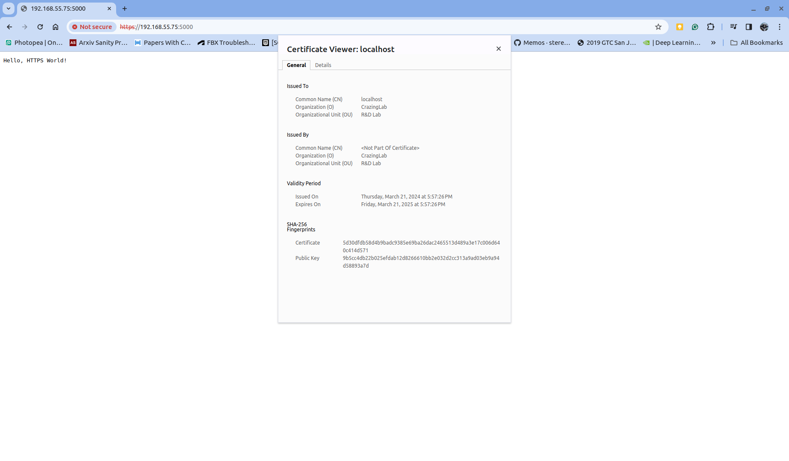
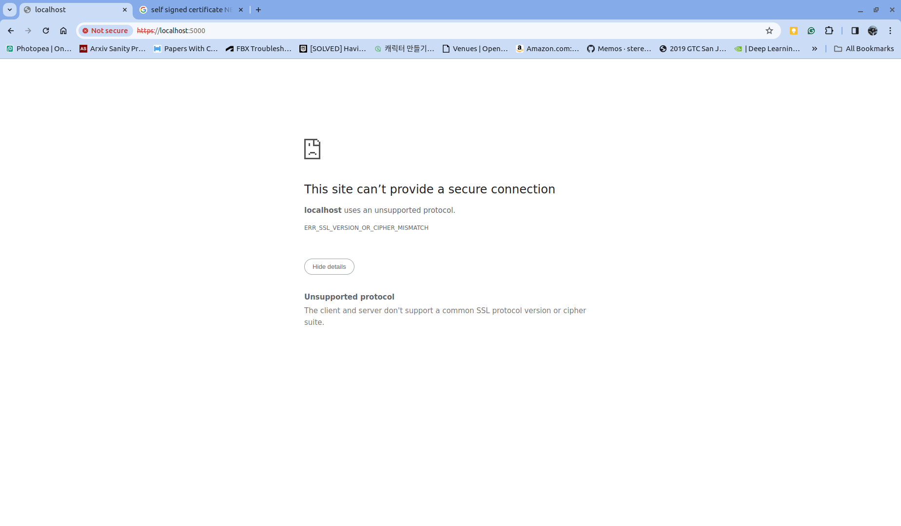

## Application Description
### References
* https://akshitb.medium.com/how-to-run-https-on-localhost-a-step-by-step-guide-c61fde893771
* https://wikidocs.net/125373
* https://nodejs.org/api/tls.html#tlsconnectoptions-callback

### Result
#### With Certificate Setup
* `NET::ERR_CERT_AUTHORITY_INVALID`

  <p align="left">
    
  </p>

#### Without Certificate Setup
* `ERR_SSL_VERSION_OR_CIPHER_MISMATCH`
  <p align="left">
    
  </p>

```diff
diff --git a/npm_samples/simple_https/server/server.js b/npm_samples/simple_https/server/server.js
index 6995888..1d49674 100644
--- a/npm_samples/simple_https/server/server.js
+++ b/npm_samples/simple_https/server/server.js
@@ -4,9 +4,10 @@ const https = require('https');
 const fs = require('fs');

 const options = {
-    key: fs.readFileSync('/home/rofox/work/frontend_samples/npm_samples/simple_https/server/server.key'), // replace it with your key path
-    cert: fs.readFileSync('/home/rofox/work/frontend_samples/npm_samples/simple_https/server/server.crt'), // replace it with your certificate path
-}
+    // key: fs.readFileSync('/home/rofox/work/frontend_samples/npm_samples/simple_https/server/server.key'), // replace it with your key path
+    // cert: fs.readFileSync('/home/rofox/work/frontend_samples/npm_samples/simple_https/server/server.crt'), // replace it with your certificate path
+  }

 https.createServer(options, (req, res) => {
   res.writeHead(200);
```
### Installation
```
mkdir server
cd server
npm init -y
npm i express fs https
npm i nodemon -D
```
### Run
```
npm run dev
```

## Generation: CAbundle.pem, crtchain.pem, private.key
### References
* https://akshitb.medium.com/how-to-run-https-on-localhost-a-step-by-step-guide-c61fde893771
* https://wikidocs.net/125373
* https://nodejs.org/api/tls.html#tlsconnectoptions-callback

### CA.pem
* CA.key
```
$ openssl genrsa -out root.key 2048
Generating RSA private key, 2048 bit long modulus (2 primes)
.....................+++++
.......................................................................+++++
e is 65537 (0x010001)
```
* CA.pem(CAbundle.pem) for Client from CA.key
```
$ openssl req -x509 -new -nodes -key root.key -sha256 -days 365 -out root.crt
You are about to be asked to enter information that will be incorporated
into your certificate request.
What you are about to enter is what is called a Distinguished Name or a DN.
There are quite a few fields but you can leave some blank
For some fields there will be a default value,
If you enter '.', the field will be left blank.
-----
Country Name (2 letter code) [AU]:KR
State or Province Name (full name) [Some-State]:Seoul
Locality Name (eg, city) []:Seoul
Organization Name (eg, company) [Internet Widgits Pty Ltd]:CrazingLab
Organizational Unit Name (eg, section) []:R&D Lab
Common Name (e.g. server FQDN or YOUR name) []:
Email Address []:jy@wom.ai
```
### server private key (server.key or private.key)
```
$ openssl genrsa -out server.key 2048
Generating RSA private key, 2048 bit long modulus (2 primes)
...................+++++
..................................................................+++++
e is 65537 (0x010001)
```
### Cert Chain (certchain.pem or chain.pem)
* server.csr (certificate request) from server.key
```
$ openssl req -new -key server.key -out server.csr
You are about to be asked to enter information that will be incorporated
into your certificate request.
What you are about to enter is what is called a Distinguished Name or a DN.
There are quite a few fields but you can leave some blank
For some fields there will be a default value,
If you enter '.', the field will be left blank.
-----
Country Name (2 letter code) [AU]:KR
State or Province Name (full name) [Some-State]:Seoul
Locality Name (eg, city) []:Seoul
Organization Name (eg, company) [Internet Widgits Pty Ltd]:CrazingLab
Organizational Unit Name (eg, section) []:R&D Lab
Common Name (e.g. server FQDN or YOUR name) []:localhost
Email Address []:jy@wom.ai

Please enter the following 'extra' attributes
to be sent with your certificate request
A challenge password []:
An optional company name []:

```
server.crt from server.csr and CA.key
```
$ openssl x509 -req -in server.csr -CA root.crt -CAkey root.key -CAcreateserial -out server.crt -days 365 -sha256
Signature ok
subject=C = KR, ST = Seoul, L = Seoul, O = CrazingLab, OU = R&D Lab, CN = localhost, emailAddress = jy@wom.ai
Getting CA Private Key
```