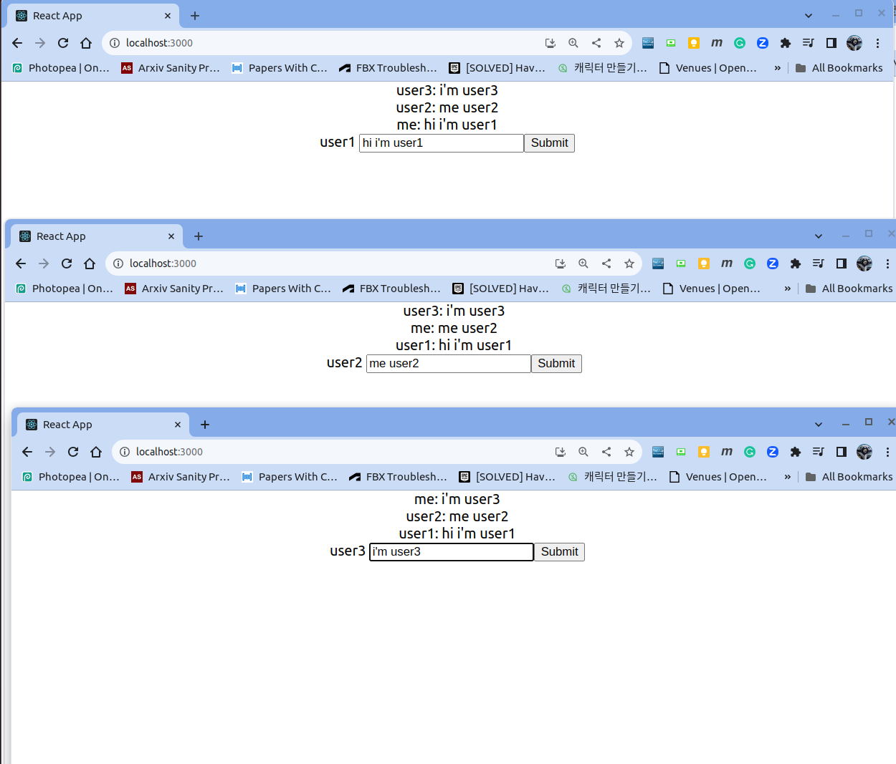

### References

* https://youtu.be/uE9Ncr6qInQ
* https://youtu.be/oFiw5VvgRFg
* https://youtu.be/pRGOEtGjI-k

    [](https://youtu.be/uE9Ncr6qInQ)
    [](https://youtu.be/oFiw5VvgRFg)
    [](https://youtu.be/pRGOEtGjI-k)

    * https://www.youtube.com/watch?v=v2GWfmZOeXI
* 채팅 방 만들기
  * https://hackmd.io/@oW_dDxdsRoSpl0M64Tfg2g/Syy1xDFep

* socket.io
  * Events:
    * https://socket.io/docs/v4/server-api/#event-connect
    * https://socket.io/docs/v4/server-api/#event-disconnect

* Web
  * https://www.freecodecamp.org/news/html-form-input-type-and-submit-button-example/

### Result
  <p align="left">
    
  </p>

### Description
#### Backend
* Database, Web Socket
* Modules
  * express - server
  * mongoose - mongodb (this project tested with version 3.6.9, default version of ubuntu 22.04)
  * cors - to help communication with frontend
  * dotenv - to use env variable
  * http -
#### Frontend
* Web Socket

### Install
* install Visual Code extension
  * https://marketplace.visualstudio.com/items?itemName=dsznajder.es7-react-js-snippets

* backend
  * base
    ```
    sudo apt-get install mongodb  # install mongodb on ubuntu machine
    ```
  * original install
    ```
    mkdir backend
    cd backend
    npm init -y
    npm i express mongoose cors dotenv http
    npm i socket.io
    npm i nodemon -D
    ```
  * reinstall from source
    ```
    npm install
    ```
  * run
    ```
    npm run dev
    ```
* frontend
  * original install
    ```
    mkdir frontend
    cd frontend
    npx create-react-app .
    npm i socket.io-client
    ```
  * reinstall from source
    ```
    npm install
    ```
  * run
    ```
    npm start
    ```
* open http://localhost:3000 on browser

### Operations

* mongodb on ubuntu
  ```
  $ mongo
  MongoDB shell version v3.6.8
  connecting to: mongodb://127.0.0.1:27017
  Implicit session: session { "id" : UUID("7626b685-599c-44d6-a648-d85816839fca") }
  MongoDB server version: 3.6.8
  Welcome to the MongoDB shell.
  For interactive help, type "help".
  For more comprehensive documentation, see
    http://docs.mongodb.org/
  Questions? Try the support group
    http://groups.google.com/group/mongodb-user
  Server has startup warnings:
  2023-12-19T09:21:29.575+0900 I STORAGE  [initandlisten]
  2023-12-19T09:21:29.575+0900 I STORAGE  [initandlisten] ** WARNING: Using the XFS filesystem is strongly recommended with the WiredTiger storage engine
  2023-12-19T09:21:29.575+0900 I STORAGE  [initandlisten] **          See http://dochub.mongodb.org/core/prodnotes-filesystem
  2023-12-19T09:21:30.184+0900 I CONTROL  [initandlisten]
  2023-12-19T09:21:30.184+0900 I CONTROL  [initandlisten] ** WARNING: Access control is not enabled for the database.
  2023-12-19T09:21:30.184+0900 I CONTROL  [initandlisten] **          Read and write access to data and configuration is unrestricted.
  2023-12-19T09:21:30.184+0900 I CONTROL  [initandlisten]
  >
  ```
  * drop (reset) the used database
  ```
  > show dbs
  admin       0.000GB
  config      0.000GB
  kakao-talk  0.000GB
  local       0.000GB
  > use kakao-talk
  switched to db kakao-talk
  > db.dropDatabase()
  { "dropped" : "kakao-talk", "ok" : 1 }
  > ls
  [native code]
  > show dbs

  ```
* show db entries
  ```
  > show dbs
  admin       0.000GB
  config      0.000GB
  kakao-talk  0.000GB
  local       0.000GB
  > use kakao-talk
  switched to db kakao-talk
  > show collections
  chats
  users
  > db.users
  kakao-talk.users
  > db.users.find()
  { "_id" : ObjectId("658143474a641c80a368255e"), "name" : "test", "token" : "a4ZsjTNKPJ2j3P2CAAAf", "online" : true, "__v" : 0 }
  { "_id" : ObjectId("658144e481906e6c5837f634"), "name" : "test2", "token" : "3VHGKP3HpMDttgmaAAAj", "online" : true, "__v" : 0 }
  { "_id" : ObjectId("6581a53381906e6c5837f64a"), "name" : "user2", "token" : "4OSg7IyLjXv0Zb6CAAAH", "online" : false, "__v" : 0 }
  { "_id" : ObjectId("6581a53881906e6c5837f64d"), "name" : "user1", "token" : "I2Cy_OFn2smVhr5vAAAD", "online" : true, "__v" : 0 }
  { "_id" : ObjectId("6581a7a2f5716fc605ff9997"), "name" : "user", "token" : "q4wR0NqdmJzu_a_pAAAR", "online" : true, "__v" : 0 }
  { "_id" : ObjectId("6581a871f5716fc605ff99c4"), "name" : "user3", "token" : "-K0CVyquj6GLVzl9AAAZ", "online" : true, "__v" : 0 }
  > db.chats.find()
  { "_id" : ObjectId("6581444f81906e6c5837f613"), "chat" : "test message", "user" : { "id" : ObjectId("658143474a641c80a368255e"), "name" : "test" }, "__v" : 0 }
  { "_id" : ObjectId("6581450f81906e6c5837f645"), "chat" : "test message", "user" : { "id" : ObjectId("658143474a641c80a368255e"), "name" : "test" }, "__v" : 0 }
  { "_id" : ObjectId("6581a53e81906e6c5837f650"), "chat" : "message", "user" : { "id" : ObjectId("6581a53881906e6c5837f64d"), "name" : "user1" }, "__v" : 0 }
  ```