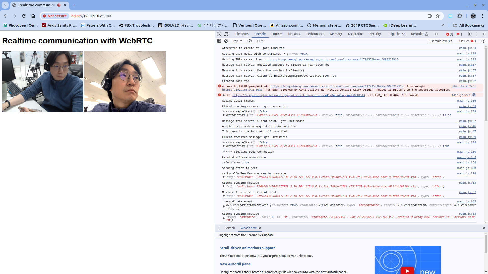

## References
* Real time communication with WebRTC
  * https://codelabs.developers.google.com/codelabs/webrtc-web/
* `express` for static file server
  * https://velog.io/@mainfn/Node.js-express%EC%97%90%EC%84%9C-static-File-Serving-%ED%95%98%EA%B8%B0
* CORS
  * https://stackoverflow.com/questions/18310394/no-access-control-allow-origin-node-apache-port-issue
  * https://inpa.tistory.com/entry/WEB-%F0%9F%93%9A-CORS-%F0%9F%92%AF-%EC%A0%95%EB%A6%AC-%ED%95%B4%EA%B2%B0-%EB%B0%A9%EB%B2%95-%F0%9F%91%8F
## Application Description

### Generate Self-Signed Certificate

```
cd simple_webrtc_https
openssl req -x509 -nodes -days 365 -newkey rsa:2048 -keyout server.key -out server.crt
...+....+..+++++++++++++++++++++++++++++++++++++++++++++++++++++++++++++++++*.....+......+.........+...+..+.............+...+..+...+.+++++++++++++++++++++++++++++++++++++++++++++++++++++++++++++++++*........+.......+..............+...+++++++++++++++++++++++++++++++++++++++++++++++++++++++++++++++++
....+...+...............+...+...+......+++++++++++++++++++++++++++++++++++++++++++++++++++++++++++++++++*........+.....+....+..+...+...+.........+................+...+..+.........+....+..+++++++++++++++++++++++++++++++++++++++++++++++++++++++++++++++++*.+.............+.....................+.....+......+...+.+..+..........+..+.......+...+........+...+......+..........+.....+....+.....+.......+........+....+.....+.+..............+.+.........+...+.........+......+..............+..................+.......+........+.......+...+..+...+.+.................+...+.+...+..+.+..+......+.......+.....+...+....+......+..+.......+......+.........+...+.....+...+....+......+.....+...............+.......+.....+...+......+....+.........+...+..............+....+..............+...+...................+........+.+.....+.+......+.....+....+...........+...+....+.....+...............+.+.....+.........+.+.....+.+......+...+........................+..+...+.......+......+...+.....+......+...+.......+.........+.........+...+........+......+..........+.........+.........+..+...+......+....+..+......+..........+..+.+..+.............+..+....+...+...........+.+.....+.........+.+......+..+......+.+++++++++++++++++++++++++++++++++++++++++++++++++++++++++++++++++
-----
You are about to be asked to enter information that will be incorporated
into your certificate request.
What you are about to enter is what is called a Distinguished Name or a DN.
There are quite a few fields but you can leave some blank
For some fields there will be a default value,
If you enter '.', the field will be left blank.
-----
Country Name (2 letter code) [AU]:KR
State or Province Name (full name) [Some-State]:Seoul
Locality Name (eg, city) []:Seoul
Organization Name (eg, company) [Internet Widgits Pty Ltd]:Crazing Lab
Organizational Unit Name (eg, section) []:R&D
Common Name (e.g. server FQDN or YOUR name) []:localhost
Email Address []:jy@wom.ai
```

### Test
* https://localhost:8080/ (Current Status)

* https://<ip address>:8080/ (Goal)

### Combined
```
cd backend
npm init -y
npm i https socket.io express
npm i nodemon -D
```
```
npm run dev
```

  <p align="left">
    
  </p>

### Frontend
```
cd frontend
npm init -y
npm i express fs https
npm i nodemon -D
```
```
npm run dev
```
### Backend
```
cd backend
npm init -y
npm i express cors https socket.io
npm i nodemon -D
```
```
npm run dev
```